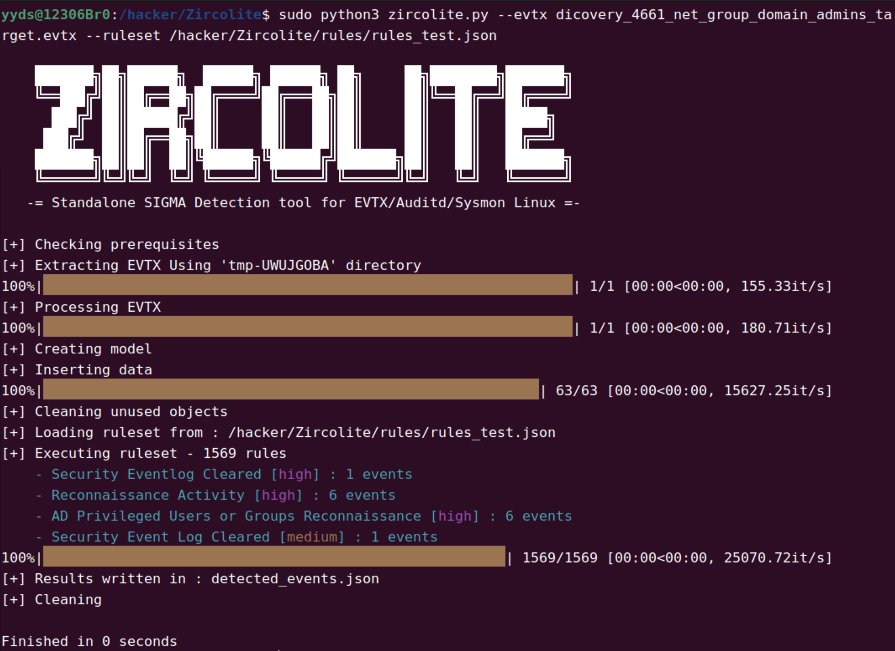
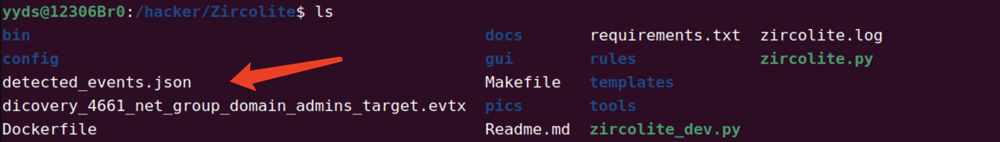
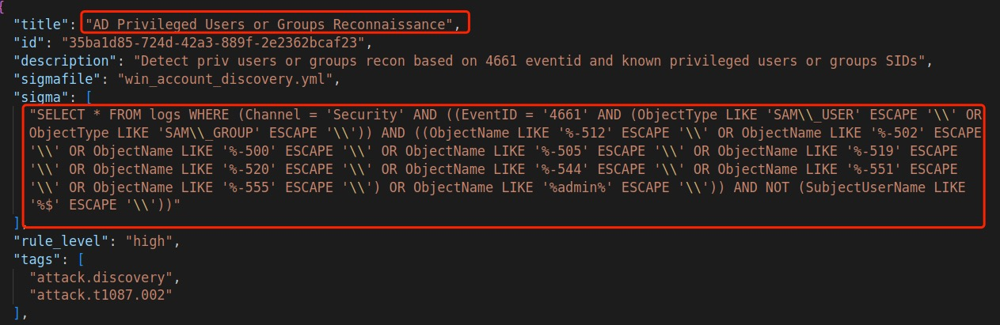
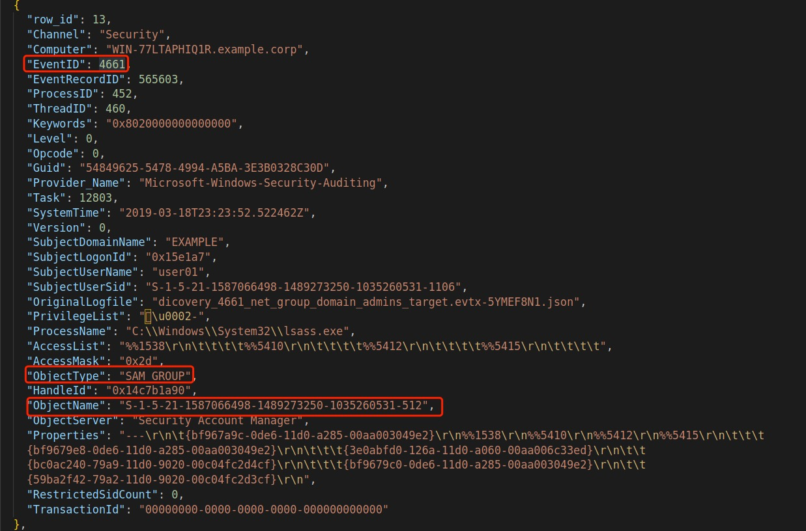
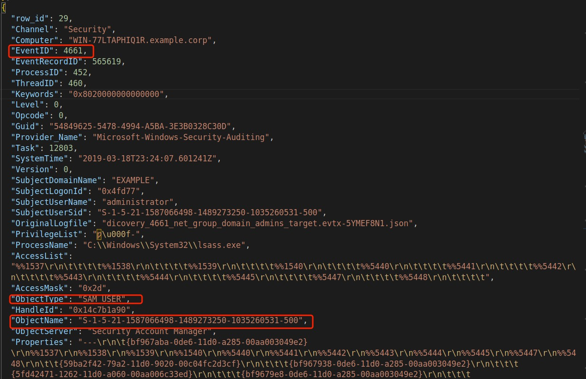
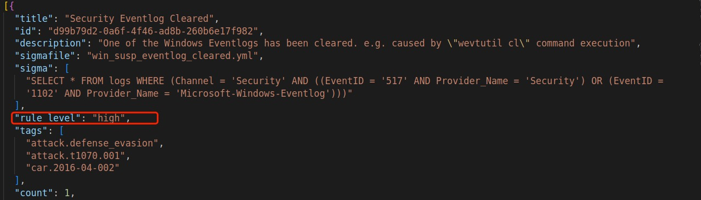
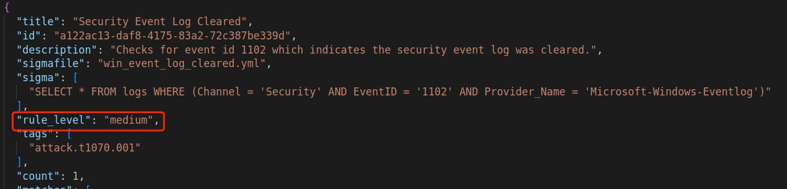

# 基于SIGMA的独立检测工具-Zircolite

在之前的文章[《深入了解Sigma规则以及如何编写自己的威胁检测规则》](https://www.freebuf.com/articles/endpoint/337439.html)中，介绍过如何编写属于自己的Sigma规则。本文将讲述如何利用开源工具[Zircolite](https://github.com/wagga40/Zircolite)结合Sigma规则集在端点进行检测。

## Zircolite

Zircolite是一个用于Python3编写的独立工具，它允许在MS Windows EVTX（EVTX和JSONL格式）、Linux Audit日志和Sysmon日志上使用Sigma规则。

- Zircolite可直接用于端点调查；
- Zircolite相对较快，可以在几秒钟内解析大型数据集；
- Zircolite基于Sigma后端(SQLite)，不使用内部Sigma转换；

Zircolite可以直接在Python中使用，也可以使用发行版中提供的二进制文件（仅限Microsoft Windows和Linux）。参考文档在[这里](https://github.com/wagga40/Zircolite/tree/master/docs)。

## Zircolite安装

使用以下命令来安装依赖项:`pip3 install -r requirements.txt`

evtx_dump的使用是可选的，但默认情况下是必需的（因为它现在要快得多），如果你不想使用它，则必须使用`--noexternal`选项。如果你克隆Zircolite存储库，则会提供该工具。对于Apple M1计算机，首选`--noexternal`选项。

## Zircolite基本用法

可以使用`zircolite.py -h`来查看帮助

### 对于EVTX文件，扩展名为".evtx"

```bash
python3 zircolite.py --evtx <EVTX_FOLDER> --ruleset <Converted Sigma rules>
python3 zircolite.py --evtx ../Logs --ruleset rules/rules_windows_sysmon.json
```

它也可以直接作用于独特的EVTX文件。

默认情况下：

- `--ruleset`不是强制性的，但默认规则集将是`rules/rules_windows_generic.json`；
- 结果写在`detected_events.json`中，与`Zircolite`在同一目录；
- 将在当前工作目录中创建一个`zircolite.log`日志文件；

### Audit日志

```bash
python3 zircolite.py --events auditd.log --ruleset rules/rules_linux.json --auditd
```

使用`--events`和`--evtx`是一样的，但`--events`更适合用于非`EVTX`日志。

### SysmonForLinux日志

SysmonForLinux已于2021年10月发布。它以文本格式输出XML，每行一个事件。从2.6.0版开始，Zircolite初步支持SysmonForLinu日志文件。要测试它，只需给你命令行添加`-S`参数。

```bash
python3 zircolite.py --events sysmon.log --ruleset rules/rules_linux.json --sysmon4linux
```

由于日志来自Linux，默认文件扩展名是.log，使用时需要使用`-S`参数指定。

### JSONL/NDJSON

可以直接在JSONL/NDJSON文件（NXLog文件）上使用Zircolite `--jsononly`或者`-j`。

```bash
python3 zircolite.py --events <EVTX_FOLDER> --ruleset <CONVERTED_SIGMA_RULES> --jsononly
```

一个简单的用例是当你已经运行Zircolite并使用`--keeptmp`选项。由于它将所有转换后的EVTX保存在一个临时目录中，如果你需要重新执行Zircolite，你可以直接使用此目录作为EVTX源（使用`--evtx <EVTX_IN_JSON_DIRECTORY>`和`--jsononly`) 并避免再次转换EVTX。

也可以使用`--fileext`更改文件扩展名。

### SQLite数据库文件

由于Zircolite中的所有内容都存储在内存中的SQlite数据库中，因此可以选择将数据库保存在磁盘上以备后用。可以选择使用`--dbfile <db_filename>`参数。

```bash
python3 zircolite.py --evtx <EVTX_FOLDER> --ruleset <CONVERTED_SIGMA_RULES> --dbfile output.db
```

如果需要重新执行Zircolite，可以直接使用SQLite数据库作为EVTX源（带有`--evtx <SAVED_SQLITE_DB_PATH>`和`--dbonly`) 并避免转换EVTX，对EVTX进行处理后并将数据插入数据库。使用这种方法可以节省大量时间...但是将无法使用`--forwardall`选项。

## 生成自己的规则集

默认规则集已在rules目录。Zircolite提供了这些开箱即用的规则集，这些规则集只是位于Sigma存储库的rules/windows，因此你应该生成自己的规则集。

### 使用sigmatools

Zircolite使用JSON格式的SIGMA规则。要生成规则集，需要使用官方sigmatools（最低0.21版）：

```bash
git clone https://github.com/SigmaHQ/sigma.git
cd sigma
```

安装Sigma依赖项，请[在此处查看](https://github.com/SigmaHQ/sigma#installation)

#### Sysmon规则集（当终端有Sysmon日志时）

```yml
tools/sigmac \
 -t sqlite \
 -c tools/config/generic/sysmon.yml \
 -c tools/config/generic/powershell.yml \
 -c tools/config/zircolite.yml \
 -d rules/windows/ \
 --output-fields title,id,description,author,tags,level,falsepositives,filename,status \
 --output-format json \
 -r \
 -o rules_sysmon.json \
 --backend-option table=logs
```

解释说明：

```yml
-t 是后端类型（SQlite）
-c 是来自官方存储库的后端配置
-r 选项用于转换整个目录（如果是单个规则转换不要忘记删除）
-o 选项用于提供输出文件名
--backend-option用于指定SQLite表名（保持原样）
```

#### 通用规则集（当终端没有Sysmon日志时）

```yml
tools/sigmac \
 -t sqlite \
 -c tools/config/generic/windows-audit.yml \
 -c tools/config/generic/powershell.yml \
 -c tools/config/zircolite.yml \
 -d rules/windows/ \
 --output-fields title,id,description,author,tags,level,falsepositives,filename,status \
 --output-format json \
 -r \
 -o rules_generic.json \
 --backend-option table=logs
```

### 即时规则转换

从Zircolite 2.2.0开始，如果你的sigmatools版本 >= 0.21，提供SIGMA配置文件和sigmac路径。方便测试，但你应该避免它，因为它比较慢：

```yml
python3 zircolite.py --evtx ../Samples/EVTX-ATTACK-SAMPLES/ \
                     --ruleset <DIRECTORY>/sigma/rules/windows/ \
                     --sigma <DIRECTORY>/sysmon.yml \
                     --sigmac <DIRECTORY>/sigmac
```

在这种情况下，由于SIGMA SQL/SQLite后端不支持某些规则，因此可以使用`--sigmaerrors`选项来显示哪个规则不被支持。

#### 为什么要建立属于自己的规则集

你应该考虑到提供的默认规则是位于Sigma规则库中的rules/Windows规则集，可能会面临以下问题：

- 某些规则会产生大量的误报；
- 某些规则可能会非常慢；

例如：

- "Suspicious Eventlog Clear or Configuration Using Wevtutil" 通常会产生大量的误报；
- "Notepad Making Network Connection" 非常明显的减慢了Zircolite的执行速度；

## 实际测试

### 获取Zircolite并安装依赖项

```yml
sudo git clone https://github.com/wagga40/Zircolite.git
cd Zircolite/
sudo pip install -r requirements.txt
python3 zircolite.py  -h
```

### 规则转换

#### 获取Sigma规则库

```bash
sudo git clone https://github.com/SigmaHQ/sigma.git
```

#### 转换规则

```bash
python3 sigmac
sudo python3 sigmac -t sqlite -d /hacker/sigma/rules/windows/  --output-fields title,id,description,author,tags,level,falsepositives,filename,status --output-format json -c /hacker/sigma/tools/config/zircolite.yml -r -o rules_test.json --backend-option table=logs
```

### 下载样例日志

[下载地址](https://github.com/sbousseaden/EVTX-ATTACK-SAMPLES)

### 测试

执行以下命令

```bash
sudo python3 zircolite.py --evtx dicovery_4661_net_group_domain_admins_target.evtx --ruleset /hacker/Zircolite/rules/rules_test.json 
```



```yml
022-07-21 23:35:44 INFO     [+] Checking prerequisites
2022-07-21 23:35:44 INFO     [+] Extracting EVTX Using 'tmp-UWUJGOBA' directory 
2022-07-21 23:35:44 INFO     [+] Processing EVTX
2022-07-21 23:35:44 INFO     [+] Creating model
2022-07-21 23:35:44 INFO     [+] Inserting data
2022-07-21 23:35:44 INFO     [+] Cleaning unused objects
2022-07-21 23:35:44 INFO     [+] Loading ruleset from : /hacker/Zircolite/rules/rules_test.json
2022-07-21 23:35:44 INFO     [+] Executing ruleset - 1569 rules
2022-07-21 23:35:44 DEBUG        - Security Eventlog Cleared [high] : 1 events
2022-07-21 23:35:44 DEBUG        - Reconnaissance Activity [high] : 6 events
2022-07-21 23:35:44 DEBUG        - AD Privileged Users or Groups Reconnaissance [high] : 6 events
2022-07-21 23:35:44 DEBUG        - Security Event Log Cleared [medium] : 1 events
2022-07-21 23:35:44 INFO     [+] Results written in : detected_events.json
2022-07-21 23:35:44 INFO     [+] Cleaning
2022-07-21 23:35:44 INFO     
```

总共执行了1569个规则，发现安全事件日志删除事件1个（日志），级别为高；侦查活动事件6个（日志），级别为高；AD特权用户或组枚举事件6个（日志），级别为高；安全事件日志删除1个（日志），级别为中。结果输出写入`detected_events.json`文件中（与`Zircolite`在同一目录）。



重点关注AD特权用户或组枚举事件





可能会疑惑为什么安全事件日志清除告警级别会出现**高**和**中**两种情况，这与Sigma规则有关，可以查看输出结果，在`detected_events.json`文件中。




## 总结

在实际测试过程中，可以看到Zircolite作为一款基于Sigma的独立检测工具，总体效果来看还是不错的，但想要在实战中发挥作用，还会有一段很长路的要走。目前来看将会面临以下问题：

- 1.国内多数端点未配置审核策略，日志质量不高；
- 2.受限于Sigma规则质量影响，可能会出现重复告警、误报等情况。

## 参考

Zircolite官方手册

<https://github.com/wagga40/Zircolite/blob/master/docs/Usage.md#usage>

Windows EVTX日志样例

<https://github.com/sbousseaden/EVTX-ATTACK-SAMPLES>

Sigma官网Github库

<https://github.com/SigmaHQ/sigma>
