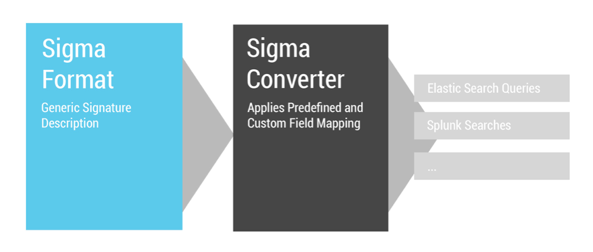
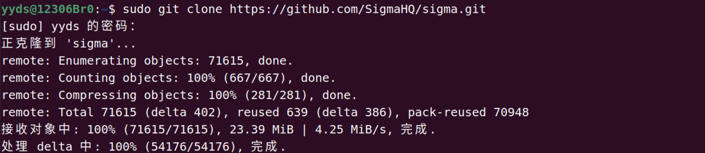
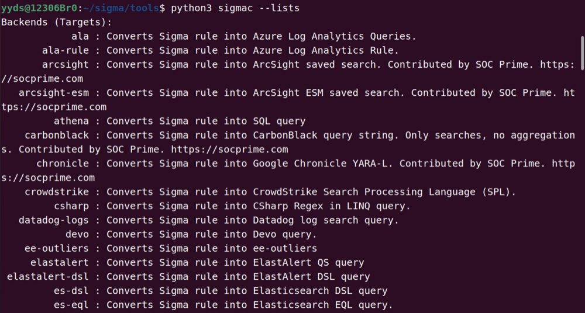
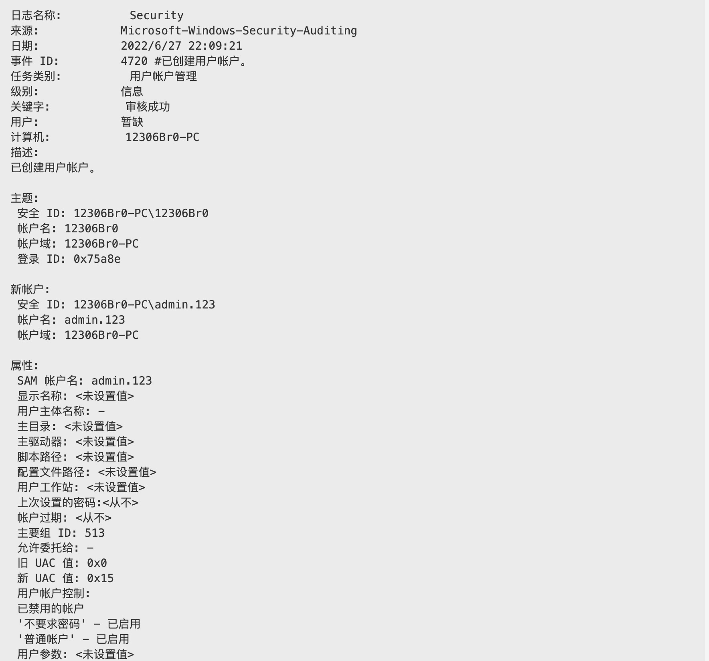
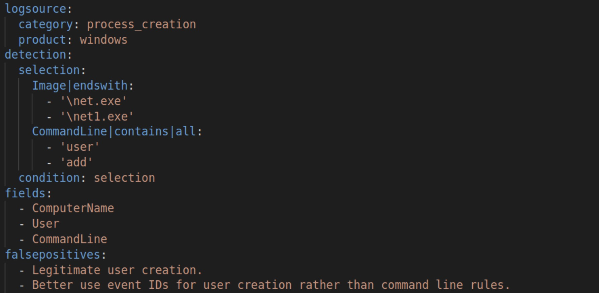

# 深入了解Sigma规则以及如何编写自己的威胁检测规则

## Sigma是一种检测语言

在之前的[文章](https://www.freebuf.com/articles/endpoint/303763.html)中，介绍了如何构建一套属于自己的小型仿真威胁狩猎平台，并利用事件日志进行威胁狩猎。本文将讲述如何借助Sigma，利用社区的力量来对关键威胁和新的攻击技术做出快速反应。

与YARA、Snort规则一样，Sigma是一种通用且开放的签名格式，以直接的方式描述相关的日志事件。规则格式非常灵活，易于编写，适用于任何类型的日志文件。Sigma提供了一种结构化的形式，研究人员或分析师可以在其中描述他们曾设计开发的检测方法，并与他人共享。

随着SIEM的普及，大多数企业会选择购买或者构建一套适用于自己企业环境的SIEM系统。对于IT系统和网络的攻击都将会被记录下来，并存储在SIEM系统或者其他日志存储和分析平台，这使得SIEM成为检测入侵者的一个重要工具。SIEM检测规则集在早期存在于厂商或特定平台的数据库中。如今，对最新安全事件的检测和分析的需求日益增长，要求不同的厂商能够共享检测情报。Sigma解决了这一问题，使查询规则集与厂商平台无关。



## Sigma允许防御者使用通用语言共享检测结果

Sigma满足各种用例：

- Sigma已成为一种通用语言，在研究人员和情报人员之间分享研究成果，如发现、识别新的攻击行为。
- 安全团队可以避免局限于单一平台，即通过在Sigma定义规则，可以更轻松地在不同平台之间切换。
- Sigma拥有众多检测方法，可开箱即用。
- 利用Sigma与其他威胁情报机构共享签名。

Sigma规则可以转换为不同的SIEM平台支持的搜索查询语句格式，支持以下SIEM平台：

- Splunk
- ElasticSearch Query Strings and DSL
- Kibana
- Microsoft Defender Advanced Threat Protection (MDATP)
- Azure Sentinel
- QRadar
- LogPoint
- Qualys
- RSA NetWitness
- LimaCharlie
- ArcSight
- PowerShell and Grep
- ......
  
## 使用Sigma

Sigma是一个开源项目，有三个主要组成部分：

- 通用Sigma规则格式的语言规范。
- Sigma签名的开放存储库，包含针对多个攻击者行为和技术的1000多条规则。
- Sigmac是一个转换实用程序，用于把Sigma规则转为不同的SIEM工具所支持的搜索查询语句。

### 获取存储库

首先，从GitHub下载Sigma存储库。

```bash
git clone https://github.com/SigmaHQ/sigma.git
```



### 了解Sigma规则

Sigma规则是用YAML编写的，它定义了在系统日志中查找的内容和位置。每个Sigma规则还可以指定元数据，例如：规则的作者、唯一规则标识符 (UUID)、MITRE ATT&CK技术和参考。

Sigma支持以下日志类型：

- 防火墙日志
- Web应用程序日志
- 代理/VPN网络日志
- 操作系统日志
  - 事件日志
  - 进程创建和审核日志
  - 系统事件

以存储库中的Sigma规则`/sigma/rules/windows/process_creationproc_creation_win_cmd_delete.yml`为例，此规则检测使用Windows Cmd命令删除文件。

```yml
title: Windows Cmd Delete File
id: 379fa130-190e-4c3f-b7bc-6c8e834485f3
status: experimental
description: `
  Adversaries may delete files left behind by the actions of their intrusion activity.
  Malware, tools, or other non-native files dropped or created on a system by an adversary may leave traces to indicate to what was done within a network and how.
  Removal of these files can occur during an intrusion, or as part of a post-intrusion process to minimize the adversary's footprint.`
author: frack113
date: 2022/01/15
references:
    - https://github.com/redcanaryco/atomic-red-team/blob/master/atomics/T1070.004/T1070.004.md
logsource:
    category: process_creation
    product: windows
detection:
    selection:
        - CommandLine|contains|all:
            - 'del'
            - /f
        - CommandLine|contains|all:
            - rmdir
            - /s
            - /q
    condition: selection
falsepositives:
    - Legitimate script
level: low
tags:
    - attack.defense_evasion
    - attack.t1070.004
```

每个规则 (yml) 都有以下部分：

- title(标题)：规则的名称。`Windows Cmd Delete File`。
- id：唯一标识规则的UUID。`379fa130-190e-4c3f-b7bc-6c8e834485f3`。
- status(状态)：experimental或者normal，在这种情况下，它是一个experimental规则。`experimental`
- description(描述)：解释规则的上下文。`Adversaries may delete files left behind by the actions of their intrusion activity.Malware, tools, or other non-native files dropped or created on a system by an adversary may leave traces to indicate to what was done within a network and how.Removal of these files can occur during an intrusion, or as part of a post-intrusion process to minimize the adversary's footprint`
- author(作者)：关于规则创建者的元数据。`frack113`
- date(时间)：规则的创建日期。`2022/01/15`
- references(参考)：参考链接到解释问题的博客文章或推文。`https://github.com/redcanaryco/atomic-red-team/blob/master/atomics/T1070.004/T1070.004.md`
- logsource(日志来源)：用于范围搜索，支持各种组合。`windows`
  - category(类别)：描述规则类别。`process_creation`
  - service(服务)：将字段名称设置为产品日志的事件。`windows`
- detection(检测)：在日志数据、关键字、时间范围和条件、类型的特定字段中的搜索值。这里寻找命令行中包含`del、/f`，或者命令行中包含`rmdir、/s、/q`。
- selection(选择)：在条件中链接的选择项。
- condition(条件)：判断满足哪些选择。`selection`
- falsepositives(误报)：描述字段，用于解释哪些事件或情况可能触发导致误报的规则。`Legitimate script`
- level(级别)：严重级别低、中、高或严重。`low`
- tags(标签)：ATT&CK标签。`attack.defense_evasion`，`attack.t1070.004`。

### 深入了解Sigma

Logsource字段：Sigma YAML中的logsource字段描述了要应用检测的日志数据。Logsource schema如下，它可以使用以下三个属性中的一个或多个：

```yml
logsource:
   category [optional]
   product [optional]
   service [optional]
   definition [optional]
```

**category(类别)：**

- 用于选择某个系列产品生成的所有日志，例如：防火墙和Web服务器日志。
- 类别示例包括：防火墙、防病毒、EDR、Web。

**product(产品)：**

- 用于选择特定产品生成的所有日志，例如：Windows、Apache。
- 产品类型可以更进一步划分，例如：Windows日志类型可分为安全日志、系统日志、应用日志、和Windows Defender日志等。

**service(服务)：**

- 仅用于选择产品日志的子集，例如：Windows系统上的安全事件日志。

常见的logsource格式示例。

```yml
logsource: 
  product: linux
  service: audit
...

logsource:
  product: security
  service: windows
...

logsource:
  product: zeek
  service: kerberos
```

detection(检测)字段：本节包含一组搜索标识符，表示对日志数据的搜索及其各自的评估机制，由两个属性控制：selection(选择)和condition(条件)。

- selection(选择)：搜索日志数据的标识符。
- condition(条件)：定义如何评估选择或过滤。

检测可以由两种不同的数据结构组成：Lists和Maps。
List YAML类型中包含多个基于字符串的搜索参数，应用于日志数据，并用逻辑"OR"链接。

例如，此检测将匹配日志中是否包含以下列表中的任何一个值。

```yml
detection:
  keywords:
    - 'nmap'
    - 'sqlmap'
    - 'nessus'
    - 'awvs'
    - 'python2.7'
  condition: keywords
```

Maps YAML类型由键/值对组成，如：字典，其中键是日志数据中的字段，值是字符串或整数值。
映射列表用逻辑“OR”连接。映射的所有元素都用逻辑"AND"连接

例如，在下面的示例中，如果ImageLoaded键包含以下任何值列表，则匹配成功。

```yml
logsource:
    product: windows
    category: driver_load
detection:
    selection:
        ImageLoaded|contains:
            - 'fgexec'
            - 'dumpsvc'
            - 'cachedump'
            - 'mimidrv'
            - 'gsecdump'
            - 'servpw'
            - 'pwdump'
    condition: selection
```

这里，选择(搜索标识符)匹配日志数据中的ImageLoaded字段，并使用转换修饰符(|contains)检查列出的关键字是否存在。

下面列出了一些修饰符:

- contains
- all
- base64
- endswith
- startswith

还可以使用通配符来匹配日志数据中的大量关键字。例如，找到rundll32.exe的执行日志，使用`\*rundll32.exe`即可，而不是通过指定的路径或命令行参数来进行查找。

对于condition(条件)，可以使用以下语句来搜索标识符:

- 合乎逻辑的`and/or`操作
- 选择其中的1个或全部选择，eg:`1 of selection` or `all of selection`
- 使用not，eg:`not selection`
- 使用括号对表达式进行分组。eg:`(selection1 and selection2 and selection3) or selection4`

在下面的示例中，如果触发了条件中的selection1、selection2、selection3，并且没有匹配filter中的任何一项，则会输出匹配结果。

```yml
detection:
  selection1:
    ParentImage|endswith:
      - '\winlogon.exe'
      - '\services.exe'
      - '\lsass.exe'
      - '\csrss.exe'
      - '\smss.exe'
      - '\wininit.exe'
      - '\spoolsv.exe'
      - '\searchindexer.exe'
  selection2:
    Image|endswith:
      - '\powershell.exe'
      - '\cmd.exe'
  selection3:
    User|contains: # covers many language settings
      - 'AUTHORI'
      - 'AUTORI'
  filter:
    CommandLine|contains|all:
      - ' route '
      - ' ADD '
  condition: selection1 and selection2 and selection3 and not filter
fields:
  - ParentImage
  - Image
  - User
  - CommandLine
```

## 编译Sigma规则

为了将Sigma规则转换为任何SIEM平台所支持的搜索查询语句，必须使用Sigma编译器`sigmac`，这是Sigma本身附带的基于python的工具。

```bash
yyds@12306Br0:~/sigma/tools$ python3 sigmac
Nothing to do!
usage: sigmac [-h] [--recurse] [--filter FILTER]
              [--target {humio,elastalert,ala-rule,kibana,sentinel-rule,xpack-watcher,ee-outliers,graylog,crowdstrike,sql,logiq,carbonblack,mdatp,netwitness-epl,netwitness,datadog-logs,streamalert,es-rule-eql,es-rule,splunkdm,uberagent,opensearch-monitor,fireeye-helix,devo,powershell,es-qs-lr,elastalert-dsl,es-eql,qradar,es-dsl,csharp,ala,hawk,grep,qualys,limacharlie,splunk,logpoint,splunkxml,sumologic,fortisiem,sqlite,fieldlist,stix,chronicle,sumologic-cse,sumologic-cse-rule,kibana-ndjson,hedera,sysmon,lacework,arcsight,arcsight-esm,es-qs,athena}]
              [--lists] [--lists-files-after-date LISTS_FILES_AFTER_DATE]
              [--config CONFIG] [--output OUTPUT]
              [--output-fields OUTPUT_FIELDS] [--output-format {json,yaml}]
              [--output-extention OUTPUT_EXTENTION] [--print0]
              [--backend-option BACKEND_OPTION]
              [--backend-config BACKEND_CONFIG] [--backend-help BACKEND_HELP]
              [--defer-abort] [--ignore-backend-errors] [--verbose] [--debug]
              [inputs ...]
```

sigmac可以将规则转换为想要执行查询的SIEM平台支持的搜索查询语句，如Splunk、Qualys和Qradar等。sigmac还使用字段映射将规则中使用的字段转换为将要执行查询的平台内的实际字段。

要查看所有可用的目标、配置，运行以下命令即可：

```bash
python3 sigmac --lists
```



**编译一个规则**

为了转换为可支持的任何SIEM平台所支持的搜索查询语句格式，可通过`-t`配置为可支持的任何SIEM平台，`-c`设置正确的字段映射:

```bash
$python3 sigmac -t splunk -c splunk-windows ~/sigma/rules/windows/process_creation/proc_creation_win_cmdkey_recon.yml
```

```sql
((Image="*\\cmdkey.exe" OR OriginalFileName="cmdkey.exe") (CommandLine="* /l*" OR CommandLine="* -l*")) | table CommandLine,ParentCommandLine,User
```

这样就可以得到一个编译后的规则，在Splunk上查找cmdkey查看缓存凭证的执行情况。

可以选择监控这些类型的日志，并利用这些日志来检测攻击者：

- 操作系统日志
  - 账户身份认证
    - 大量的登录失败
    - 特殊账户的变更和使用，以及SID历史
  - 进程创建和执行
    - 在非正常的位置执行
    - 可疑的进程关系
    - 具有未知哈希的已知可执行文件
    - 已知恶意哈希
  - 资源访问
  - windows事件
    - 不常见的服务设施
    - 新的域信任关系
  - 网络：端口扫描，主机发现
- 代理日志
- Web服务器访问日志
  - 4xx 错误：可能是扫描探测行为
  - 5xx 错误：可能是利用行为
- 应用程序错误日志
  - 异常或其他特定的消息。eg:[可疑的SQL错误消息](https://github.com/12306Bro/Threathunting-book/blob/master/Windows/03%E5%88%9D%E5%A7%8B%E8%AE%BF%E9%97%AE/T1190-%E5%8F%AF%E7%96%91%E7%9A%84SQL%E9%94%99%E8%AF%AF%E6%B6%88%E6%81%AF.md)

## 挑战：编写自己的Sigma规则

接下来将学习如何编写Sigma规则，在实际的SIEM平台上运用。建议在本地构建一套小型仿真威胁狩猎平台，在此基础上可以尝试模拟一些攻击行为，并构建自己的检测规则。

### 用于检测创建本地用户账户的Sigma规则

MITRE ATT&CK中提到的[创建用户](https://attack.mitre.org/techniques/T1136/001/)，攻击者可能会创建一个本地帐户来维持对被攻击系统的访问。本地帐户是由组织配置供用户、远程支持、服务使用或用于管理单个系统或服务的帐户。有了足够的权限，可使用net user /add命令创建本地帐户。

```powershell
Microsoft Windows [版本 6.1.7601]
版权所有 (c) 2009 Microsoft Corporation。保留所有权利。

C:\Windows\system32>net user admin.123 admin1 /add
命令成功完成。
```

此时可以为我们的Sigma规则构建一个基础框架。

```yml
title: 创建本地用户账户行为
status: test
description: `使用net user /add命令创建本地用户帐户`
references: 
  - https://attack.mitre.org/techniques/T1136/001/
date: 2022/06/27
author: 狂徒张三
level: low
```

观察windows安全日志，是否记录了用户账户创建。windows安全日志[4720](https://docs.microsoft.com/zh-cn/windows/security/threat-protection/auditing/event-4720)记录了已创建用户账户`admin.123`。



可将windows安全事件ID`4720`作为条件，来检测是否存在创建本地用户账户行为。完整的规则如下：

```yml
title: 创建本地用户账户行为
status: test
description: `使用net user /add命令创建本地用户帐户`
references: 
  - https://attack.mitre.org/techniques/T1136/001/
date: 2022/06/27
author: 狂徒张三
logsource:
    product: windows
    service: security
detection:
    selection:
        EventID: 4720 #已创建用户帐户。
    condition: selection
fields:
    - EventCode
    - AccountName
    - AccountDomain
falsepositives:
    - 域控制器日志
    - 由特权帐户管理工具管理的本地用户账户
level: low
```

事实上关于检测使用`net user /add`命令创建用户账户行为，还可以通过windows安全事件日志[4688](https://docs.microsoft.com/zh-cn/windows/security/threat-protection/auditing/event-4688)中的进程名称及命令行参数进行检测。



最后，编写Sigma规则后，使用sigmac将sigma规则转换为其他SIEM平台所支持的格式。

```sql
(source="WinEventLog:Security" EventCode="4720") | table EventCode,AccountName,AccountDomain
```

```sql
((Image="*\\net.exe" OR Image="*\\net1.exe") CommandLine="*user*" CommandLine="*add*") | table ComputerName,User,CommandLine
```

**你学废了没有？**
